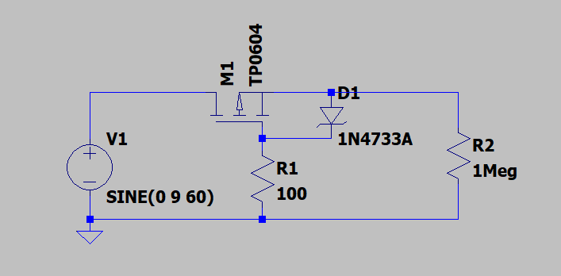

## Reverse Polarity Circuit

Keeping your hardware safe in a project is very important, and sometimes due to human negligence, paths get shorted, or a voltage source gets conected in reverse.
To keep the hardware from our projects safe without the need for human attention, we can add "safety circuit" blocks into our project. 
This repo has LTSpice simulations for a reverse voltage protection circuit. 

### Components used
|Quantity| Component Type  | Component Name|
|--------|---------------- |---------------|
|1       |P-Channel MOSFET |TP0604         |
|1       | NPN BJT         | NHUMD12-QX    |
|1       | Zener Diode     | 1N4733A       |
|1       | Resistor        | 100&#937;     |
|1       |Resistor         | 1M&#937;      |

### Reverse Polarity Protection Circuit

